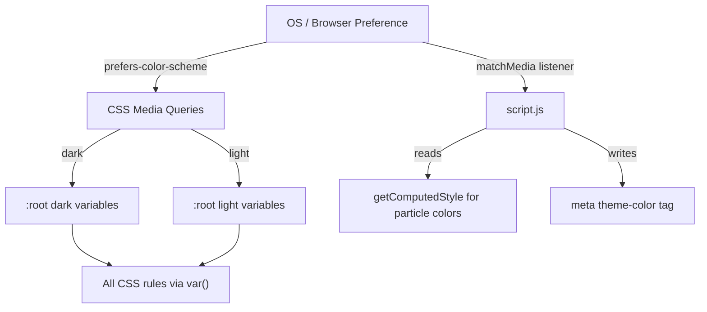

# Design Document: Theme and Font Update

## Overview

This design describes the changes needed to add automatic light/dark theme support and a distinct heading font to the personal links page. The core architectural change is restructuring CSS custom properties so that all color variables live exclusively inside `@media (prefers-color-scheme: dark)` and `@media (prefers-color-scheme: light)` blocks, with the bare `:root` retaining only structural (non-color) variables. A light theme palette is introduced as an equal peer to the existing dark (Klein blue) theme. The particle background animation in `script.js` is updated to read colors from CSS custom properties so it adapts to the active theme. Modals, lightbox, toast, and overlays are converted from hardcoded dark colors to theme-aware variables. The h1 element gets the Roboto font, and a small JS snippet keeps the `<meta name="theme-color">` tag in sync with the active scheme.

### Files Changed

| File | Change Summary |
|------|---------------|
| `style.css` | Restructure `:root` variables; add `prefers-color-scheme` media query blocks; convert hardcoded colors to variables; add `.profile h1` font rule |
| `index.html` | Add Roboto Google Font `<link>`; no other structural changes |
| `script.js` | Read particle/line colors from CSS custom properties via `getComputedStyle`; add `matchMedia` listener to update `theme-color` meta tag and re-read particle colors on scheme change |

## Architecture

The theme system follows a pure CSS-first approach with minimal JS augmentation:



### Design Decisions

1. **No JS theme toggle** — The requirements specify automatic switching only via `prefers-color-scheme`. No manual toggle is needed, keeping the implementation simple.

2. **CSS-only variable resolution** — All color values flow through CSS custom properties. Components never reference hardcoded hex/rgba values. This means the particle canvas is the only place JS must actively read theme colors, since canvas drawing can't use CSS variables directly.

3. **Peer media queries, no cascade fallback** — Both `@media (prefers-color-scheme: dark)` and `@media (prefers-color-scheme: light)` define the complete set of color variables. Neither depends on the other. This avoids subtle bugs where a missing variable silently falls back to the wrong theme.

4. **New CSS variables for JS-consumed colors** — Two new variables (`--particle-rgb` and `--particle-line-rgb`) are added so the canvas code can construct `rgba()` strings without parsing hex values at runtime.

## Components and Interfaces

### 1. CSS Theme Layer (`style.css`)

**Bare `:root`** — structural variables only:
```css
:root {
  --border-radius: 12px;
  --transition: 0.3s cubic-bezier(0.4, 0, 0.2, 1);
}
```

**Dark theme block** — preserves current Klein blue palette:
```css
@media (prefers-color-scheme: dark) {
  :root {
    --bg-primary: #0b0e18;
    --bg-section: #0f1322;
    --bg-card: #141a2e;
    --bg-hover: #182040;
    --klein: #002fa7;
    --klein-light: #2b5cd6;
    --klein-glow: rgba(0, 47, 167, 0.2);
    --silver: #c0c8d8;
    --text-primary: #dce1eb;
    --text-secondary: #7a8499;
    --text-desc: #566078;
    --border-subtle: rgba(43, 92, 214, 0.08);
    --overlay-bg: rgba(5, 7, 14, 0.85);
    --lightbox-bg: rgba(5, 7, 14, 0.92);
    --modal-border: rgba(43, 92, 214, 0.2);
    --modal-shadow: rgba(0, 0, 0, 0.5);
    --hover-border: rgba(43, 92, 214, 0.15);
    --avatar-border: rgba(43, 92, 214, 0.3);
    --section-hover-shadow: rgba(0, 0, 0, 0.25);
    --lightbox-close-bg: rgba(255, 255, 255, 0.08);
    --lightbox-close-hover: rgba(255, 255, 255, 0.15);
    --lightbox-close-color: #fff;
    --modal-close-hover-bg: rgba(255, 255, 255, 0.05);
    --copy-btn-bg: rgba(43, 92, 214, 0.15);
    --copy-btn-border: rgba(43, 92, 214, 0.2);
    --key-row-bg: rgba(0, 47, 167, 0.06);
    --key-row-border: rgba(43, 92, 214, 0.15);
    --toast-border: rgba(43, 92, 214, 0.3);
    --wip-badge-bg: rgba(122, 132, 153, 0.15);
    --particle-rgb: 43, 92, 214;
    --particle-line-rgb: 43, 92, 214;
    --theme-color: #002fa7;
  }
}
```

**Light theme block** — new palette:
```css
@media (prefers-color-scheme: light) {
  :root {
    --bg-primary: #f5f7fa;
    --bg-section: #ffffff;
    --bg-card: #f0f2f5;
    --bg-hover: #e8ebf0;
    --klein: #002fa7;
    --klein-light: #2b5cd6;
    --klein-glow: rgba(0, 47, 167, 0.1);
    --silver: #4a5568;
    --text-primary: #1a202c;
    --text-secondary: #4a5568;
    --text-desc: #718096;
    --border-subtle: rgba(43, 92, 214, 0.1);
    --overlay-bg: rgba(0, 0, 0, 0.5);
    --lightbox-bg: rgba(0, 0, 0, 0.7);
    --modal-border: rgba(43, 92, 214, 0.15);
    --modal-shadow: rgba(0, 0, 0, 0.15);
    --hover-border: rgba(43, 92, 214, 0.2);
    --avatar-border: rgba(43, 92, 214, 0.25);
    --section-hover-shadow: rgba(0, 0, 0, 0.08);
    --lightbox-close-bg: rgba(0, 0, 0, 0.08);
    --lightbox-close-hover: rgba(0, 0, 0, 0.15);
    --lightbox-close-color: #fff;
    --modal-close-hover-bg: rgba(0, 0, 0, 0.05);
    --copy-btn-bg: rgba(43, 92, 214, 0.1);
    --copy-btn-border: rgba(43, 92, 214, 0.15);
    --key-row-bg: rgba(0, 47, 167, 0.04);
    --key-row-border: rgba(43, 92, 214, 0.12);
    --toast-border: rgba(43, 92, 214, 0.2);
    --wip-badge-bg: rgba(74, 85, 104, 0.1);
    --particle-rgb: 0, 47, 167;
    --particle-line-rgb: 0, 47, 167;
    --theme-color: #f5f7fa;
  }
}
```


### 2. Hardcoded Color Replacement Map

Every hardcoded color in `style.css` is replaced with a CSS variable reference. Key replacements:

| Hardcoded Value | CSS Variable | Used In |
|----------------|-------------|---------|
| `rgba(5, 7, 14, 0.85)` | `var(--overlay-bg)` | `.modal-overlay` background |
| `rgba(5, 7, 14, 0.92)` | `var(--lightbox-bg)` | `.lightbox` background |
| `rgba(43, 92, 214, 0.3)` | `var(--avatar-border)` | `.avatar` border |
| `rgba(43, 92, 214, 0.2)` | `var(--modal-border)` | `.modal-card` border |
| `rgba(43, 92, 214, 0.15)` | `var(--hover-border)` | `.link-btn:hover` border |
| `rgba(0, 0, 0, 0.5)` | `var(--modal-shadow)` | `.modal-card` box-shadow |
| `rgba(0, 0, 0, 0.25)` | `var(--section-hover-shadow)` | `.link-section:hover` box-shadow |
| `rgba(255, 255, 255, 0.08)` | `var(--lightbox-close-bg)` | `.lightbox-close` background |
| `rgba(255, 255, 255, 0.15)` | `var(--lightbox-close-hover)` | `.lightbox-close:hover` background |
| `#fff` (lightbox close) | `var(--lightbox-close-color)` | `.lightbox-close` color |
| `rgba(255, 255, 255, 0.05)` | `var(--modal-close-hover-bg)` | `.modal-close:hover` background |
| `rgba(43, 92, 214, 0.15)` | `var(--copy-btn-bg)` | `.copy-btn` background |
| `rgba(43, 92, 214, 0.2)` | `var(--copy-btn-border)` | `.copy-btn` border |
| `rgba(0, 47, 167, 0.06)` | `var(--key-row-bg)` | `.modal-key-row` background |
| `rgba(43, 92, 214, 0.15)` | `var(--key-row-border)` | `.modal-key-row` border |
| `rgba(43, 92, 214, 0.3)` | `var(--toast-border)` | `.toast` border |
| `rgba(122, 132, 153, 0.15)` | `var(--wip-badge-bg)` | `.wip-badge` background |
| `rgba(0, 47, 167, 0.35)` (keyframe) | `var(--klein-glow)` with adjusted alpha | `@keyframes pulse-glow` |

### 3. Particle Background Adaptation (`script.js`)

The `drawParticles()` function currently hardcodes `rgba(43, 92, 214, ...)`. The update:

1. Add a helper function `getParticleColors()` that reads `--particle-rgb` and `--particle-line-rgb` from `getComputedStyle(document.documentElement)`.
2. Store the RGB triplet strings in module-level variables (`particleRGB`, `lineRGB`).
3. Replace hardcoded `rgba(43, 92, 214, ...)` with template literals using the stored RGB values: `` `rgba(${particleRGB}, ${p.opacity})` ``.
4. On `matchMedia('(prefers-color-scheme: dark)').change` event, re-read the colors.

### 4. Theme-Color Meta Tag (`script.js`)

A `matchMedia` listener updates the `<meta name="theme-color">` content attribute:

```js
const schemeQuery = window.matchMedia('(prefers-color-scheme: dark)');
function updateThemeColor() {
  const color = getComputedStyle(document.documentElement).getPropertyValue('--theme-color').trim();
  document.querySelector('meta[name="theme-color"]').setAttribute('content', color);
}
schemeQuery.addEventListener('change', updateThemeColor);
updateThemeColor();
```

### 5. Heading Font (`index.html` + `style.css`)

**HTML**: Add Roboto to the Google Fonts `<link>`:
```html
<link href="https://fonts.googleapis.com/css2?family=Inter:wght@400;500;600;700&family=Roboto:wght@700&display=swap" rel="stylesheet">
```

**CSS**: Apply to h1 only:
```css
.profile h1 {
  font-family: 'Roboto', -apple-system, BlinkMacSystemFont, sans-serif;
  font-size: 1.75rem;
  font-weight: 700;
  margin-bottom: 0.6rem;
  color: var(--text-primary);
}
```

## Data Models

This feature does not introduce any persistent data models. All state is derived from the browser's `prefers-color-scheme` media query at runtime. The relevant runtime data:

| Data | Type | Source | Lifetime |
|------|------|--------|----------|
| Active color scheme | `'light' \| 'dark'` | `window.matchMedia('(prefers-color-scheme: ...)')` | Session, auto-updates |
| Particle RGB string | `string` (e.g. `"43, 92, 214"`) | `getComputedStyle` reading `--particle-rgb` | Refreshed on scheme change |
| Theme-color value | `string` (hex) | `getComputedStyle` reading `--theme-color` | Refreshed on scheme change |

No localStorage, cookies, or server-side storage is involved.


## Correctness Properties

*A property is a characteristic or behavior that should hold true across all valid executions of a system — essentially, a formal statement about what the system should do. Properties serve as the bridge between human-readable specifications and machine-verifiable correctness guarantees.*

### Property 1: Theme variable set symmetry

*For any* CSS custom property name defined in the `@media (prefers-color-scheme: dark)` block, that same property name must also be defined in the `@media (prefers-color-scheme: light)` block, and vice versa. The two sets of variable names must be identical.

**Validates: Requirements 1.5**

### Property 2: Text-background contrast sufficiency

*For any* pairing of a text color variable (`--text-primary`, `--text-secondary`, `--text-desc`, `--silver`) and its corresponding background color variable (`--bg-primary`, `--bg-section`, `--bg-card`) in either theme, the WCAG contrast ratio between the text color and background color should be at least 4.5:1 (AA level for normal text).

**Validates: Requirements 3.3, 5.2**

### Property 3: Font family exclusivity

*For any* text-rendering element on the page that is not the `.profile h1`, the resolved `font-family` CSS value should begin with `Inter`. Conversely, the `.profile h1` element's resolved `font-family` should begin with `Roboto`.

**Validates: Requirements 6.2, 6.3**

## Error Handling

This feature has a minimal error surface since it is purely presentational CSS + lightweight JS:

| Scenario | Handling |
|----------|----------|
| Browser does not support `prefers-color-scheme` | Both media query blocks are ignored. No `:root` color variables are defined. **Mitigation**: not required per requirements (modern browsers all support this), but if desired a bare `:root` fallback could be added in the future. |
| Google Fonts CDN fails to load Roboto | The `font-family` declaration includes a system sans-serif fallback stack (`-apple-system, BlinkMacSystemFont, sans-serif`). The h1 renders in the system font gracefully. |
| `getComputedStyle` returns empty string for `--particle-rgb` | The `getParticleColors()` function should fall back to the dark theme default (`"43, 92, 214"`) if the read value is empty or undefined. |
| `meta[name="theme-color"]` element missing from DOM | The `updateThemeColor()` function should guard with a null check on `querySelector` result before calling `setAttribute`. |
| Canvas context unavailable | Already handled by existing code — particle animation simply doesn't run. No change needed. |

## Testing Strategy

### Unit Tests

Unit tests verify specific, concrete behaviors using known values:

- **Theme structure tests** (static CSS analysis):
  - Bare `:root` contains only `--border-radius` and `--transition` (no color variables) — validates 1.3, 1.4
  - Dark theme block defines all expected color variables — validates 1.1
  - Light theme block defines all expected color variables — validates 1.2
  - Dark theme preserves original Klein blue values (`--bg-primary: #0b0e18`, `--klein: #002fa7`, etc.) — validates 2.3

- **Light theme palette tests**:
  - `--bg-primary` is a light value (luminance > 0.9) — validates 3.1
  - `--bg-section`, `--bg-card`, `--bg-hover` are light values — validates 3.2
  - `--klein` and `--klein-light` are identical in both themes — validates 3.4

- **Particle color tests**:
  - In dark scheme, `--particle-rgb` equals `"43, 92, 214"` — validates 4.2
  - In light scheme, `--particle-rgb` produces a color distinguishable from `--bg-primary` — validates 4.1
  - `getParticleColors()` falls back to default when CSS variable is empty

- **Modal/overlay tests**:
  - Modal, lightbox, and toast CSS rules reference `var(--*)` not hardcoded rgba — validates 5.1, 5.3

- **Font tests**:
  - HTML contains Google Fonts link with `family=Roboto` — validates 6.1
  - `.profile h1` CSS rule specifies `font-family: 'Roboto'` with fallbacks — validates 6.2, 6.4

- **Meta tag tests**:
  - `updateThemeColor()` sets meta content to `--theme-color` value — validates 7.1, 7.2
  - Dark theme `--theme-color` is `#002fa7` — validates 7.2

### Property-Based Tests

Property-based tests use randomized inputs to verify universal invariants. Use a JS property-based testing library such as `fast-check`.

Each property test must run a minimum of 100 iterations and be tagged with a comment referencing the design property.

- **Property 1: Theme variable set symmetry**
  - Tag: `Feature: theme-and-font-update, Property 1: Theme variable set symmetry`
  - Generate: Parse both media query blocks, extract variable name sets. For any randomly selected variable name from either set, assert it exists in both sets.

- **Property 2: Text-background contrast sufficiency**
  - Tag: `Feature: theme-and-font-update, Property 2: Text-background contrast sufficiency`
  - Generate: For any combination of (theme: dark|light) × (text variable) × (background variable), compute the WCAG contrast ratio and assert ≥ 4.5.

- **Property 3: Font family exclusivity**
  - Tag: `Feature: theme-and-font-update, Property 3: Font family exclusivity`
  - Generate: For any text-rendering DOM element selected at random, assert its computed `font-family` starts with `Inter` if it is not `.profile h1`, or starts with `Roboto` if it is `.profile h1`.
